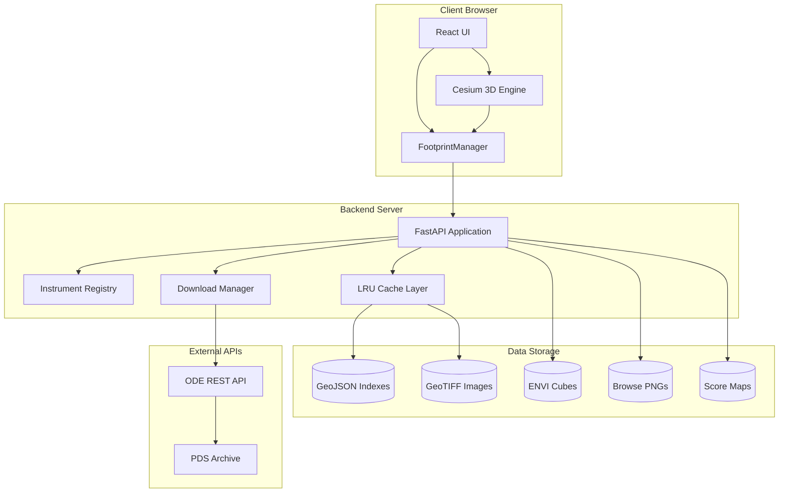
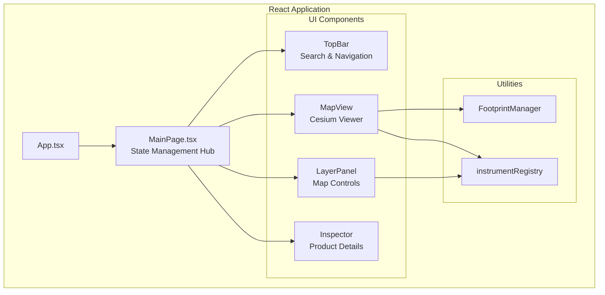
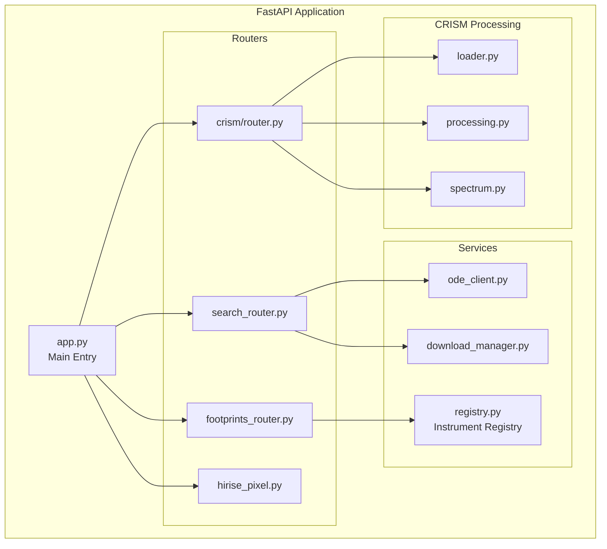
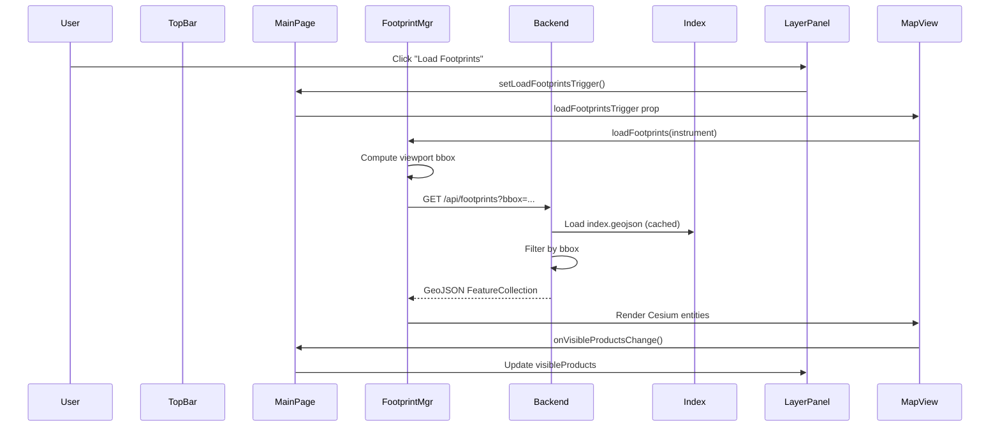
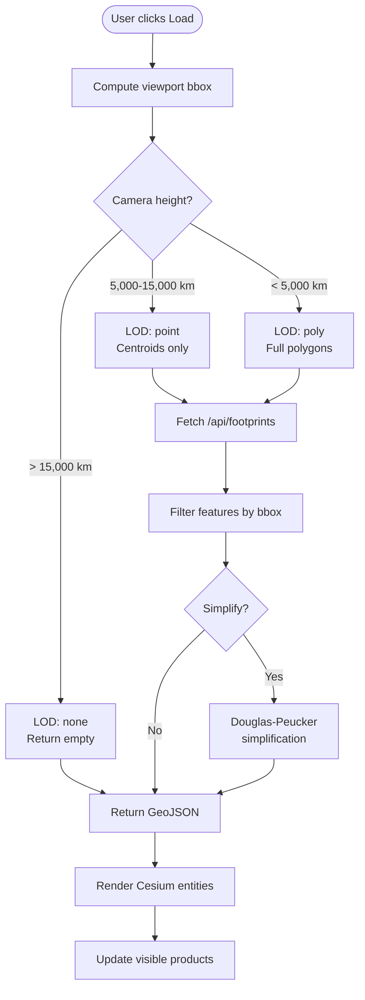
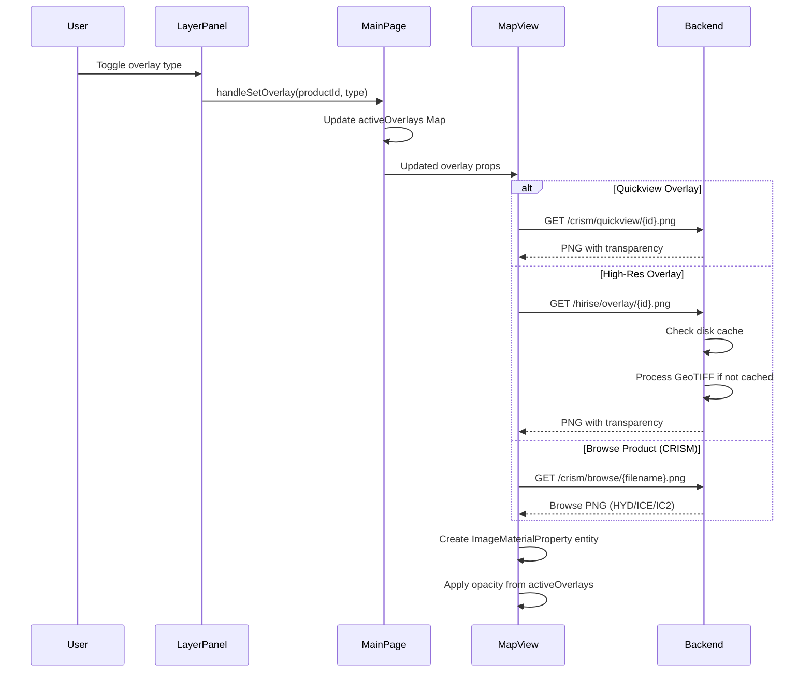
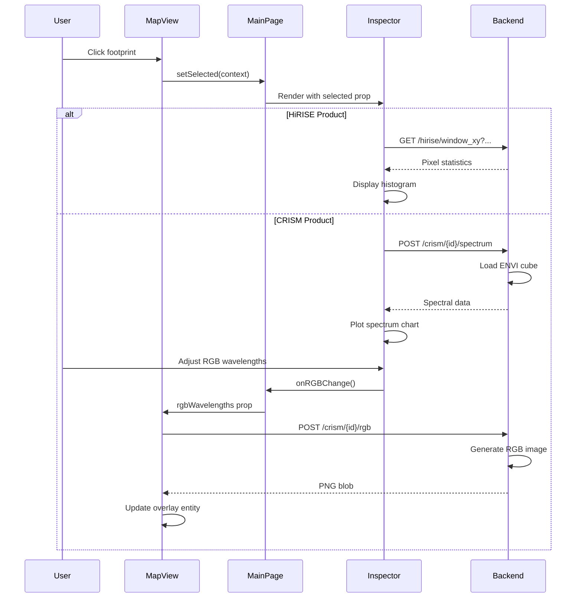
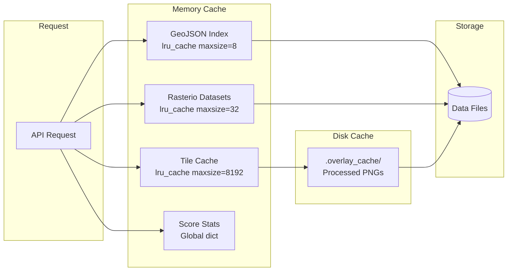
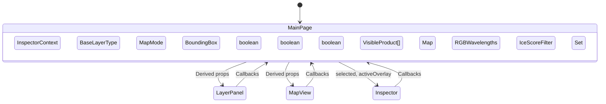

# MarsLab Architecture

This document describes the high-level architecture of MarsLab, including system components, data flows, and key subsystems.

---

## System Overview

MarsLab is a client-server web application for exploring Mars orbital science data:



---

## Component Architecture

### Frontend Components



**Key Component Responsibilities:**

| Component | File | Responsibility |
|-----------|------|----------------|
| `MainPage` | `pages/MainPage.tsx` | Central state management, coordinates all child components |
| `MapView` | `components/MapView.tsx` | Cesium viewer, footprint rendering, overlay management |
| `LayerPanel` | `components/LayerPanel.tsx` | Map controls, footprint toggles, active products list |
| `Inspector` | `components/Inspector.tsx` | Product details, spectral analysis, overlay controls |
| `TopBar` | `components/TopBar.tsx` | Search bar with typeahead |
| `FootprintManager` | `utils/FootprintManager.ts` | Explicit footprint loading, Cesium entity management |

### Backend Components



---

## Data Flow Diagrams

### 1. Product Discovery Flow

How users find and select products:



### 2. Footprint Loading Flow

Detailed footprint loading with LOD:



### 3. Overlay Rendering Flow

How overlays (quickview, high-res, browse) are displayed:



### 4. Inspector Interaction Flow

Product inspection and analysis:



---

## Map Rendering Subsystem

### Cesium Configuration

The Cesium viewer is configured for Mars:

```typescript
// Mars ellipsoid (IAU-defined)
const MARS_ELLIPSOID = new Cesium.Ellipsoid(
  3396190.0,  // Equatorial radius (m)
  3396190.0,
  3376200.0   // Polar radius (m)
);

// Viewer setup
const viewer = new Cesium.Viewer(container, {
  baseLayerPicker: false,
  animation: false,
  timeline: false,
  sceneModePicker: false,
  // ... other disabled UI elements
});
```

**Code Reference:** `frontend/src/components/MapView.tsx:50-100`

### Base Layers

Two base layer options from NASA Trek:

| Layer | Source | Description |
|-------|--------|-------------|
| MOLA | NASA Trek | Mars Global Surveyor elevation data |
| HRSC | NASA Trek | Viking color mosaic |

### Entity Types

| Entity Type | Geometry | Usage |
|-------------|----------|-------|
| Rectangle | Polygon bounds | Footprint outlines, overlays |
| Point | Centroid | Point-mode footprints |
| Polyline | LineString | SHARAD radar tracks |
| Label | Text | Product ID labels |

---

## Caching Architecture

### Backend Caching Layers



**Cache Details:**

| Cache | Location | Max Size | TTL | Purpose |
|-------|----------|----------|-----|---------|
| `load_geojson_index` | `footprints_router.py:53` | 8 | Forever | GeoJSON indexes |
| `open_ds` | `app.py:72` | 32 | Forever | Rasterio dataset handles |
| `load_world_tile` | `app.py:136` | 8192 | Forever | Tile PNG bytes |
| `.overlay_cache/` | Disk | Unlimited | Forever | Processed HiRISE overlays |
| `_score_stats_cache` | `app.py:448` | 1 | Forever | Score statistics JSON |

### Frontend Caching

- **LBL bounds cache:** Parsed label file bounds (in-memory Map)
- **Blob URL management:** CRISM RGB images as blob URLs
- **FootprintManager:** Maintains feature maps per instrument

---

## State Management Architecture

### Frontend State Flow



**State Variables (MainPage.tsx:93-152):**

| State | Type | Purpose |
|-------|------|---------|
| `selected` | `InspectorContext \| null` | Currently selected product |
| `baseLayer` | `"MOLA" \| "HRSC"` | Active base map |
| `mapMode` | `"2D" \| "3D"` | View mode |
| `viewBounds` | `BoundingBox \| null` | Optional view restriction |
| `showCRISM/HiRISE/SHARAD` | `boolean` | Footprint visibility |
| `visibleProducts` | `VisibleProduct[]` | Products in current view |
| `activeOverlays` | `Map<string, ProductOverlay>` | Active overlay per product |
| `rgbWavelengths` | `RGBWavelengths` | CRISM RGB composition |
| `iceScoreFilter` | `IceScoreFilter` | Ice score filter config |

---

## Security Considerations

### CORS Configuration

```python
app.add_middleware(
    CORSMiddleware,
    allow_origins=["*"],
    allow_credentials=False,
    allow_methods=["*"],
    allow_headers=["*"],
)
```

**Code Reference:** `backend/app.py:30-36`

**Note:** This permissive CORS is suitable for development. For production, restrict `allow_origins` to specific domains.

### Input Validation

- **Pydantic models** validate request bodies
- **Query parameter validation** via FastAPI Query()
- **Coordinate bounds checking** in footprints API
- **File path sanitization** to prevent path traversal

---

## Error Handling Patterns

### Backend Error Handling

```python
# HTTP exceptions for client errors
raise HTTPException(status_code=404, detail="Product not found")

# Graceful degradation for optional features
try:
    from shapely.geometry import shape
    SHAPELY_AVAILABLE = True
except ImportError:
    SHAPELY_AVAILABLE = False
```

### Frontend Error Handling

- **AbortController** for request cancellation
- **Try-catch** around async operations
- **Null checks** before entity operations
- **Fallback rendering** when data unavailable

---

## Key Architectural Decisions

### 1. Explicit Footprint Loading

**Decision:** Footprints load only on explicit user action, not automatically on camera movement.

**Rationale:**
- Prevents request spam during rapid panning
- Gives user control over data loading
- Reduces server load

**Code Reference:** `frontend/src/utils/FootprintManager.ts:1-9`

### 2. Single Overlay Per Product

**Decision:** Each product can have only one active overlay type at a time.

**Rationale:**
- Simplifies z-ordering management
- Clearer user experience
- Reduces Cesium entity count

**Code Reference:** `frontend/src/pages/MainPage.tsx:192-210`

### 3. Server-Side LOD Enforcement

**Decision:** Server enforces LOD based on camera height, overriding client requests.

**Rationale:**
- Prevents abuse/mistakes
- Consistent performance
- Reduces bandwidth for distant views

**Code Reference:** `backend/api/footprints_router.py:246-258`

### 4. Disk Cache for Processed Overlays

**Decision:** HiRISE overlays are cached to disk after processing.

**Rationale:**
- Expensive processing (GeoTIFF to PNG with transparency)
- Frequent re-requests for same products
- Persistent across server restarts

**Code Reference:** `backend/app.py:184-245`
