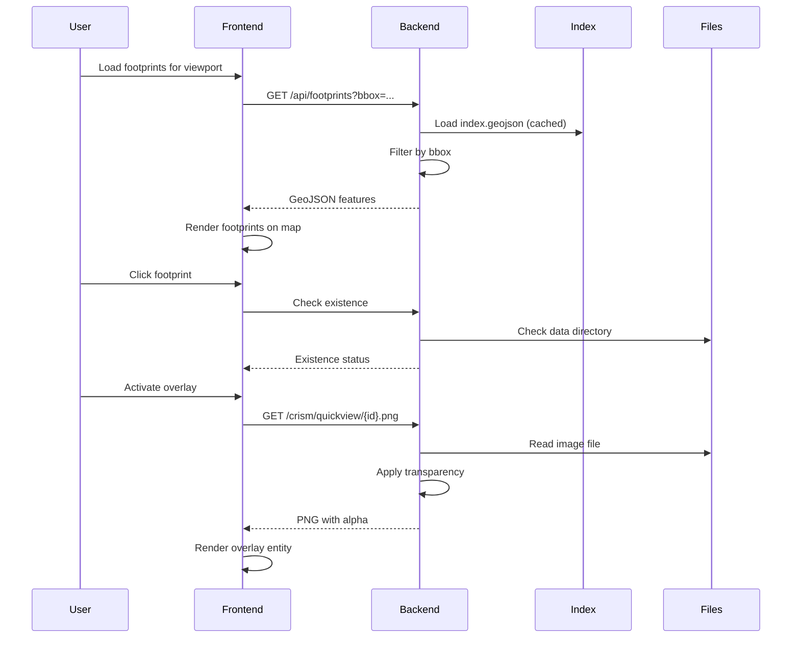

# Data Model & Storage Layout

This document defines the canonical data models, index schemas, and storage conventions used in MarsLab.

---

## Core Concepts

### Product

A **product** is a single scientific observation/dataset from a Mars orbiter instrument.

| Field | Description |
|-------|-------------|
| `product_id` | Unique identifier from PDS archive |
| `instrument` | Source instrument (CRISM, HiRISE, SHARAD) |
| `geometry` | Geographic footprint on Mars surface |
| `files` | Associated data files (images, labels, tables) |

**Product ID Patterns:**

| Instrument | Pattern | Example |
|------------|---------|---------|
| CRISM | `(frt\|hrl\|hrs\|frs\|arl\|atl)[0-9a-f]+` | `frt0001fd76_07_if166j_mtr3` |
| HiRISE | `(ESP\|PSP\|TRA)_[0-9]+_[0-9]+` | `ESP_024943_2345` |
| SHARAD | `S_[0-9]+_.*` | `S_00172401_THM` |

### Overlay Variant

An **overlay variant** is a visualization layer derived from product data.

| Type | Description | Instruments |
|------|-------------|-------------|
| `quickview` | Low-resolution preview thumbnail | All |
| `highres` | Full-resolution processed image | HiRISE |
| `browse_HYD` | Hydration mineral detection | CRISM |
| `browse_ICE` | Water ice detection | CRISM |
| `browse_IC2` | Alternate ice detection | CRISM |
| `score_ice` | Computed ice score map | CRISM |
| `score_hyd` | Computed hydration score map | CRISM |

### Footprint Geometry

A **footprint** defines the geographic extent of a product observation.

| Instrument | Geometry Type | Description |
|------------|---------------|-------------|
| CRISM | Polygon | Rectangular observation swath |
| HiRISE | Polygon | Rectangular image footprint |
| SHARAD | LineString | Linear radar track |

---

## Index / Registry Schema

### Instrument Registry

**File:** `backend/data/registry.json`

Defines all supported instruments:

```json
{
  "version": "1.0",
  "instruments": {
    "crism": {
      "id": "crism",
      "name": "CRISM",
      "display_name": "Compact Reconnaissance Imaging Spectrometer for Mars",
      "geometry_type": "Polygon",
      "color": "#00FFFF",
      "data_directory": "crism_data",
      "index_file": "index.geojson",
      "product_id_pattern": "^(frt|hrl|hrs|frs|arl|atl)[0-9a-f]+",
      "quickview_path": "crism_quickview",
      "browse_path": "crism_browse",
      "supports_spectrum": true,
      "supports_rgb": true,
      "file_types": {
        "primary": [".img"],
        "label": [".lbl"],
        "header": [".hdr"],
        "supplementary": [".tab"]
      }
    },
    "hirise": {
      "id": "hirise",
      "name": "HiRISE",
      "display_name": "High Resolution Imaging Science Experiment",
      "geometry_type": "Polygon",
      "color": "#FFFF00",
      "data_directory": "hirise_data",
      "index_file": "index.geojson",
      "product_id_pattern": "^(ESP|PSP|TRA)_[0-9]+",
      "quickview_path": "hirise_quickview",
      "supports_spectrum": false,
      "supports_rgb": false,
      "file_types": {
        "primary": [".tif", ".jp2"],
        "label": [".lbl"],
        "supplementary": []
      }
    },
    "sharad": {
      "id": "sharad",
      "name": "SHARAD",
      "display_name": "SHAllow RADar",
      "geometry_type": "LineString",
      "color": "#FFA500",
      "data_directory": "sharad_data",
      "index_file": "index.geojson",
      "product_id_pattern": "^S_[0-9]+",
      "quickview_path": "sharad_quickview",
      "highres_path": "sharad_highres",
      "supports_spectrum": false,
      "supports_rgb": false,
      "file_types": {
        "primary": [".tif"],
        "label": [],
        "supplementary": []
      }
    }
  }
}
```

### Footprint Index Schema

Each instrument has an `index.geojson` file following GeoJSON FeatureCollection format.

**Schema:**

```typescript
interface FootprintIndex {
  type: "FeatureCollection";
  features: FootprintFeature[];
}

interface FootprintFeature {
  type: "Feature";
  properties: {
    product_id: string;         // Required: unique identifier
    instrument?: string;        // Optional: instrument name
    quicklook?: string;         // Optional: quickview URL path
    [key: string]: any;         // Instrument-specific properties
  };
  geometry: {
    type: "Polygon" | "Point" | "LineString";
    coordinates: number[] | number[][] | number[][][];
  };
}
```

#### CRISM Index Properties

```json
{
  "product_id": "frt0001fd76_07_if166j_mtr3",
  "instrument": "CRISM",
  "mtr3_img": "frt0001fd76_07_if166j_mtr3.img",
  "mtr3_lbl": "frt0001fd76_07_if166j_mtr3.lbl",
  "quicklook": "/crism/quickview/frt0001fd76_07_brvnaj_mtr3.png"
}
```

#### HiRISE Index Properties

```json
{
  "product_id": "ESP_024943_2345",
  "instrument": "HIRISE",
  "red_tif": "ESP_024943_2345_RED.tif",
  "quicklook": "/hirise/quickview/ESP_024943_2345.jpg",
  "center_latitude": 54.337367,
  "center_longitude": 212.025108
}
```

#### SHARAD Index Properties

```json
{
  "product_id": "S_00172401_THM",
  "instrument": "SHARAD",
  "quickview": "/sharad/quickview/s_00172401_thm.jpg",
  "highres": "/sharad/highres/s_00172401_thm.tif",
  "start_lat": -83.7667,
  "start_lon": -149.87558,
  "stop_lat": -74.87346,
  "stop_lon": -165.50261
}
```

### Score Statistics Schema

**File:** `backend/crism_score/score_stats.json`

Precomputed statistics for efficient filtering:

```json
{
  "frt00003156": {
    "ice": {
      "valid_pixels": 880710,
      "threshold_counts": {
        "0.1": 11,
        "0.2": 9,
        "0.3": 5,
        "0.5": 2
      },
      "max_score": 0.62,
      "mean_score": 4.28e-06
    },
    "hyd": {
      "valid_pixels": 880710,
      "threshold_counts": {
        "0.1": 45000,
        "0.2": 12000,
        "0.3": 3500
      },
      "max_score": 0.85,
      "mean_score": 0.012
    }
  }
}
```

---

## On-Disk Storage Layout

### Directory Structure

```
backend/
├── data/
│   └── registry.json                    # Instrument registry
│
├── crism_data/                          # CRISM observations
│   ├── index.geojson                    # Footprint index (1.6 MB)
│   └── {base_key}/                      # Per-observation directories
│       ├── {product_id}.img             # ENVI image data
│       ├── {product_id}.lbl             # PDS label
│       ├── {product_id}.hdr             # ENVI header
│       └── {base_key}_wv*.tab           # Wavelength table
│
├── hirise_data/                         # HiRISE products
│   ├── index.geojson                    # Footprint index
│   ├── {product_id}_RED.tif             # GeoTIFF image
│   └── {product_id}_RED.lbl             # PDS label
│
├── sharad_data/                         # SHARAD tracks
│   └── index.geojson                    # Track index
│
├── crism_quickview/                     # CRISM thumbnails
│   └── {product_id}.png
│
├── crism_browse/                        # CRISM browse products
│   ├── {base_key}_brhydj_mtr3.png       # Hydration
│   ├── {base_key}_bricej_mtr3.png       # Ice
│   ├── {base_key}_bric2j_mtr3.png       # Ice variant
│   └── {base_key}_HYD.png               # Processed overlay
│
├── crism_score/                         # Score map data
│   ├── score_stats.json                 # Precomputed statistics
│   └── {base_key}/                      # Per-observation scores
│       ├── ice_score.npy                # Numpy array
│       └── hyd_score.npy                # Numpy array
│
├── hirise_quickview/                    # HiRISE thumbnails
│   └── {product_id}.jpg
│
├── sharad_quickview/                    # SHARAD thumbnails
│   └── {product_id}.jpg
│
├── sharad_highres/                      # SHARAD full-res
│   └── {product_id}.tif
│
└── .overlay_cache/                      # Cached processed overlays
    └── {product_id}_{max_size}.png
```

### Naming Conventions

#### CRISM Products

**Base Key:** First two underscore-separated tokens from product ID.

```
frt0001fd76_07_if166j_mtr3
└─────┬─────┘
   base_key: frt0001fd76_07
```

**File Naming:**
```
{base_key}_{type}_{product_type}.{ext}

Examples:
- frt0001fd76_07_if166j_mtr3.img    # Image data
- frt0001fd76_07_if166j_mtr3.lbl    # Label
- frt0001fd76_07_if166j_mtr3.hdr    # ENVI header
- frt0001fd76_07_wv166j_mtr3.tab    # Wavelength table
```

**Browse Products:**
```
{base_key}_br{CODE}j_{product_type}.png

Codes:
- HYD: Hydration minerals
- ICE: Water ice
- IC2: Ice variant
- VNA: Olivine
- MAF: Mafic minerals
- TRU: Thermal regions
- FEM: Ferric minerals
- FEL: Ferrous minerals
- FAL: Feldspathic minerals
```

#### HiRISE Products

```
{product_id}_RED.{ext}

Examples:
- ESP_024943_2345_RED.tif    # GeoTIFF image
- ESP_024943_2345_RED.lbl    # PDS label
- ESP_024943_2345_RED.jp2    # JPEG2000 (download format)
```

#### SHARAD Products

```
s_{product_number}_{suffix}.{ext}

Examples:
- s_00172401_thm.jpg    # Thumbnail
- s_00172401_thm.tif    # High-resolution
```

---

## Example Product Entries

### CRISM Example

**Product ID:** `frt0001fd76_07_if166j_mtr3`

**Index Entry:**
```json
{
  "type": "Feature",
  "properties": {
    "product_id": "frt0001fd76_07_if166j_mtr3",
    "instrument": "CRISM",
    "mtr3_img": "frt0001fd76_07_if166j_mtr3.img",
    "mtr3_lbl": "frt0001fd76_07_if166j_mtr3.lbl",
    "quicklook": "/crism/quickview/frt0001fd76_07_brvnaj_mtr3.png"
  },
  "geometry": {
    "type": "Polygon",
    "coordinates": [[[74.127214, 22.387579], [74.389479, 22.387579], [74.389479, 22.652841], [74.127214, 22.652841], [74.127214, 22.387579]]]
  }
}
```

**Files:**
```
crism_data/frt0001fd76_07/
├── frt0001fd76_07_if166j_mtr3.img    # 250 MB - spectral cube
├── frt0001fd76_07_if166j_mtr3.lbl    # 15 KB - metadata
├── frt0001fd76_07_if166j_mtr3.hdr    # 2 KB - ENVI header
└── frt0001fd76_07_wv166j_mtr3.tab    # 50 KB - wavelength table

crism_browse/
├── frt0001fd76_07_brhydj_mtr3.png    # Hydration browse
├── frt0001fd76_07_bricej_mtr3.png    # Ice browse
└── frt0001fd76_07_bric2j_mtr3.png    # Ice2 browse

crism_quickview/
└── frt0001fd76_07_brvnaj_mtr3.png    # Quickview thumbnail
```

**API Responses:**

```bash
# Get footprint
GET /api/footprints?instrument=CRISM&bbox=74,22,75,23

# Get spectrum
POST /crism/frt0001fd76_07_if166j_mtr3/spectrum
{"line": 100, "sample": 200}

# Generate RGB
POST /crism/frt0001fd76_07_if166j_mtr3/rgb
{"r": 2.53, "g": 1.51, "b": 1.08}
```

### HiRISE Example

**Product ID:** `ESP_024943_2345`

**Index Entry:**
```json
{
  "type": "Feature",
  "properties": {
    "product_id": "ESP_024943_2345",
    "instrument": "HIRISE",
    "red_tif": "ESP_024943_2345_RED.tif",
    "quicklook": "/hirise/quickview/ESP_024943_2345.jpg",
    "center_latitude": 54.337367743289505,
    "center_longitude": 212.02510847949
  },
  "geometry": {
    "type": "Polygon",
    "coordinates": [[[211.8825, 54.0211], [212.1677, 54.0211], [212.1677, 54.6536], [211.8825, 54.6536], [211.8825, 54.0211]]]
  }
}
```

**Files:**
```
hirise_data/
├── ESP_024943_2345_RED.tif    # 500 MB - GeoTIFF
└── ESP_024943_2345_RED.lbl    # 10 KB - PDS label

hirise_quickview/
└── ESP_024943_2345.jpg        # 100 KB - JPEG thumbnail
```

### SHARAD Example

**Product ID:** `S_00172401_THM`

**Index Entry:**
```json
{
  "type": "Feature",
  "properties": {
    "product_id": "S_00172401_THM",
    "instrument": "SHARAD",
    "quickview": "/sharad/quickview/s_00172401_thm.jpg",
    "highres": "/sharad/highres/s_00172401_thm.tif",
    "start_lat": -83.7667,
    "start_lon": -149.87558,
    "stop_lat": -74.87346,
    "stop_lon": -165.50261
  },
  "geometry": {
    "type": "LineString",
    "coordinates": [[-149.87558, -83.7667], [-165.50261, -74.87346]]
  }
}
```

**Files:**
```
sharad_quickview/
└── s_00172401_thm.jpg    # Radargram thumbnail

sharad_highres/
└── s_00172401_thm.tif    # Full-resolution radargram
```

---

## Data Flow: Product Discovery to Display



---

## TypeScript Type Definitions

For frontend usage:

```typescript
// Footprint response from API
interface FootprintResponse {
  type: "FeatureCollection";
  features: FootprintFeature[];
  metadata: {
    truncated: boolean;
    returned: number;
    total_estimate: number;
    lod: "none" | "point" | "poly";
    original_lod: "none" | "point" | "poly";
    lod_enforced: boolean;
    simplify: "low" | "mid" | "high" | null;
    bbox: [number, number, number, number];
    instrument: string;
  };
}

interface FootprintFeature {
  type: "Feature";
  properties: {
    product_id: string;
    instrument?: string;
    [key: string]: any;
  };
  geometry: {
    type: "Point" | "Polygon" | "LineString";
    coordinates: number[] | number[][] | number[][][];
  };
}

// Product overlay state
type OverlayType =
  | "quickview"
  | "highres"
  | "browse_HYD"
  | "browse_ICE"
  | "browse_IC2"
  | "score_ice"
  | "score_hyd";

interface ProductOverlay {
  type: OverlayType;
  opacity: number;  // 0-100
}

// Visible product in map view
interface VisibleProduct {
  productId: string;
  instrument: "HIRISE" | "CRISM" | "SHARAD";
  title?: string;
}
```

---

## Python Data Classes

For backend usage:

```python
from dataclasses import dataclass
from typing import Optional, List, Dict
from enum import Enum

class Instrument(Enum):
    CRISM = "crism"
    HIRISE = "hirise"
    SHARAD = "sharad"

@dataclass
class InstrumentConfig:
    id: str
    name: str
    display_name: str
    geometry_type: str
    color: str
    data_directory: str
    index_file: str
    product_id_pattern: str
    quickview_path: str
    supports_spectrum: bool
    supports_rgb: bool
    file_types: Dict[str, List[str]]
    browse_path: Optional[str] = None
    highres_path: Optional[str] = None

@dataclass
class CRISMBundle:
    base_key: str
    img_file: Optional["ODEFile"]
    lbl_file: Optional["ODEFile"]
    hdr_file: Optional["ODEFile"]
    tab_file: Optional["ODEFile"]
    browse_files: List["ODEFile"]
    product_type: Optional[str]

@dataclass
class HiRISEBundle:
    product_id: str
    jp2_file: Optional["ODEFile"]
    lbl_file: Optional["ODEFile"]
```
