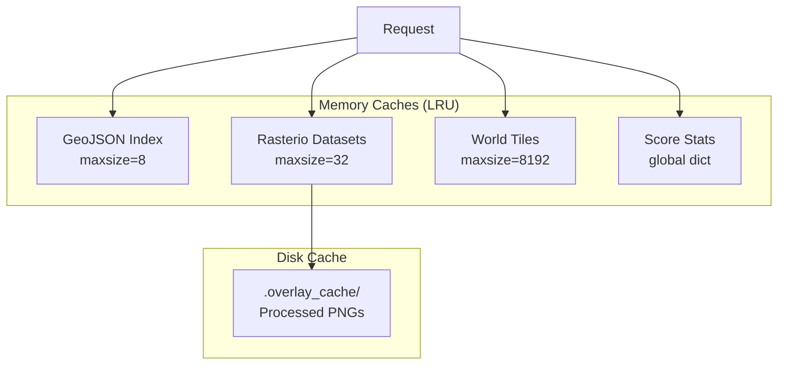

# Performance Documentation

This document covers performance bottlenecks, optimization strategies, LOD implementation, caching, and profiling techniques for MarsLab.

---

## Known Bottlenecks

### 1. Footprint Rendering

**Problem:** Loading thousands of Cesium entities causes:
- High CPU/GPU draw call overhead
- Memory pressure from entity objects
- UI freezes during pan/zoom

**Solution:** Viewport-based loading with LOD enforcement.

**Code Reference:** `PERF_NOTES.md`, `frontend/src/utils/FootprintManager.ts`

### 2. Overlay Image Processing

**Problem:** Processing large GeoTIFF files for overlay display is expensive:
- Reading from disk
- Resampling to smaller size
- Adding transparency
- PNG encoding

**Solution:** Disk caching of processed overlays.

**Code Reference:** `backend/app.py:184-245` (`.overlay_cache/`)

### 3. Camera Event Spam

**Problem:** Rapid camera movements trigger excessive API requests.

**Solution:** Explicit user-triggered loading (no automatic camera-driven updates).

**Code Reference:** `frontend/src/utils/FootprintManager.ts:1-9`

### 4. CRISM Cube Loading

**Problem:** ENVI hyperspectral cubes are large (100-500 MB), slow to load.

**Solution:** Load only required bands for RGB generation.

**Code Reference:** `backend/api/crism/loader.py`

### 5. Index File Loading

**Problem:** Loading full GeoJSON indexes (1.6 MB+) takes time.

**Solution:** LRU caching of parsed indexes.

**Code Reference:** `backend/api/footprints_router.py:53-68`

---

## Level-of-Detail (LOD) Strategy

### LOD Thresholds

```python
# Backend enforcement (footprints_router.py:211-216)
LOD_THRESHOLDS_KM = {
    "FAR": 15000,   # > 15,000 km: no footprints
    "MID": 5000,    # 5,000-15,000 km: points only
    # < 5,000 km: full polygons
}
```

### LOD Behavior

| Camera Height | LOD | Geometry | Reason |
|---------------|-----|----------|--------|
| > 15,000 km | `none` | Empty | Global view - too many features |
| 5,000-15,000 km | `point` | Centroids | Regional view - simplified |
| < 5,000 km | `poly` | Polygons | Local view - full detail |

### Geometry Simplification

When `simplify` parameter is provided:

```python
SIMPLIFY_TOLERANCES = {
    "low": 0.01,    # ~1km at equator
    "mid": 0.005,   # ~500m at equator
    "high": 0.001,  # ~100m at equator
}
```

Uses Douglas-Peucker algorithm via Shapely.

### LOD Diagram

```
┌─────────────────────────────────────────────────────────┐
│                    Camera Height                         │
├──────────────┬──────────────────┬───────────────────────┤
│  > 15,000 km │  5,000-15,000 km │  < 5,000 km           │
│              │                  │                        │
│   lod=none   │   lod=point      │   lod=poly            │
│   (empty)    │   (centroids)    │   (full polygons)     │
│              │                  │                        │
│   ░░░░░░░░   │   • • • • • •    │   ┌─┐ ┌─┐ ┌─┐         │
│   ░░░░░░░░   │   • • • • • •    │   └─┘ └─┘ └─┘         │
│              │                  │                        │
│   0 entities │   ~500 entities  │   ~500 entities       │
└──────────────┴──────────────────┴───────────────────────┘
```

---

## Caching Architecture

### Backend Caching



### Cache Configuration

| Cache | Type | Max Size | TTL | Hit Rate Target |
|-------|------|----------|-----|-----------------|
| `load_geojson_index` | LRU | 8 | Forever | 99%+ |
| `open_ds` | LRU | 32 | Forever | 90%+ |
| `load_world_tile` | LRU | 8192 | Forever | 80%+ |
| `.overlay_cache/` | Disk | Unlimited | Forever | 95%+ |
| `_score_stats_cache` | Global | 1 | Forever | 100% |

### Cache Hit Patterns

```
First request for CRISM footprints:
  1. Check load_geojson_index → MISS
  2. Load from disk (50ms)
  3. Cache result

Subsequent requests:
  1. Check load_geojson_index → HIT
  2. Return cached (0.1ms)
```

### Cache Warming

On server startup, consider pre-loading:

```python
# Optional: warm caches on startup
@app.on_event("startup")
async def warm_caches():
    for inst in ["crism", "hirise", "sharad"]:
        load_geojson_index(inst)
    _load_score_stats()
```

---

## Rendering Optimization

### Cesium Entity Management

**Problem:** Creating/removing many entities is slow.

**Solution:** Batch operations with event suspension:

```typescript
// Bad - triggers re-render on each add
for (const feature of features) {
  viewer.entities.add(entity);
}

// Good - batch with event suspension
viewer.entities.suspendEvents();
for (const feature of features) {
  viewer.entities.add(entity);
}
viewer.entities.resumeEvents();
viewer.scene.requestRender();
```

**Code Reference:** `frontend/src/utils/FootprintManager.ts:273-441`

### Entity Reuse

Currently using clear-and-recreate pattern. For higher performance:

```typescript
// Current approach: clear all, recreate
clearFootprints(instrument);
renderFootprints(instrument, features);

// Alternative: diff-based update (more complex)
const existingIds = new Set(getEntityIds());
const newIds = new Set(features.map(f => f.properties.product_id));

// Remove entities not in new set
// Add entities not in existing set
// Update entities in both sets (if needed)
```

### Image Material Optimization

For overlay rendering:

```typescript
// Use appropriate image size
const maxSize = getOptimalSize(cameraHeight);

// Prefer simple materials
material: new Cesium.ImageMaterialProperty({
  image: imageUrl,
  transparent: true,  // Enable alpha
  alpha: opacity,
})
```

---

## Profiling Techniques

### Frontend Profiling

**React DevTools Profiler:**
1. Install React DevTools extension
2. Open Profiler tab
3. Record during interaction
4. Analyze render times

**Cesium Inspector:**
```typescript
// Enable Cesium inspector
viewer.extend(Cesium.viewerCesiumInspectorMixin);
```

**Performance Monitor:**
```typescript
// frontend/src/utils/perfMonitor.ts
export function measureTime(label: string, fn: () => void) {
  const start = performance.now();
  fn();
  const elapsed = performance.now() - start;
  console.log(`[PERF] ${label}: ${elapsed.toFixed(2)}ms`);
}
```

**Chrome DevTools:**
1. Performance tab → Record
2. Execute action
3. Analyze flame graph

### Backend Profiling

**Request Timing:**
```python
import time
from functools import wraps

def timed(func):
    @wraps(func)
    async def wrapper(*args, **kwargs):
        start = time.perf_counter()
        result = await func(*args, **kwargs)
        elapsed = time.perf_counter() - start
        print(f"[PERF] {func.__name__}: {elapsed*1000:.2f}ms")
        return result
    return wrapper

@timed
@app.get("/api/footprints")
async def get_footprints(...):
    ...
```

**cProfile:**
```bash
python -m cProfile -s cumtime -m uvicorn app:app
```

**Memory Profiling:**
```python
from memory_profiler import profile

@profile
def load_large_index():
    ...
```

### Network Profiling

**Browser Network Tab:**
1. Open DevTools → Network
2. Filter by domain
3. Check response times, sizes, compression

**curl timing:**
```bash
curl -w "@curl-format.txt" -o /dev/null -s "http://localhost:8000/api/footprints?..."
```

---

## Scaling to Large Datasets

### Current Limits

| Dataset | Current Size | Max Tested |
|---------|--------------|------------|
| CRISM footprints | ~5,700 | 10,000 |
| HiRISE footprints | ~2,000 | 5,000 |
| SHARAD tracks | ~3,000 | 5,000 |
| Overlays displayed | ~10 | 50 |

### Scaling Recommendations

#### 1. Spatial Indexing

For 10,000+ footprints, consider R-tree indexing:

```python
from rtree import index

# Build spatial index
idx = index.Index()
for i, feature in enumerate(features):
    bbox = get_bbox(feature)
    idx.insert(i, bbox)

# Query by bbox
matching_ids = list(idx.intersection(query_bbox))
```

#### 2. Tile-Based Loading

For 50,000+ footprints, implement tiled loading:

```
/api/footprints/tile/{z}/{x}/{y}
```

With pre-generated vector tiles (e.g., using tippecanoe).

#### 3. Database Backend

For 100,000+ footprints, migrate from GeoJSON files to PostGIS:

```sql
CREATE INDEX footprints_geom_idx ON footprints USING GIST (geometry);

SELECT * FROM footprints
WHERE geometry && ST_MakeEnvelope(min_lon, min_lat, max_lon, max_lat)
AND ST_Intersects(geometry, ST_MakeEnvelope(...));
```

#### 4. WebGL Rendering

For 10,000+ simultaneous entities, consider:
- Cesium primitives instead of entities
- Custom WebGL shaders
- Point cloud visualization

---

## Performance Metrics

### Target Metrics

| Metric | Target | Current |
|--------|--------|---------|
| Initial page load | < 3s | ~2s |
| Footprint load (100) | < 500ms | ~300ms |
| Footprint load (1000) | < 2s | ~1.5s |
| Overlay activation | < 1s | ~500ms |
| Camera pan (smooth) | 60 fps | 30-60 fps |
| Memory usage | < 500 MB | ~300 MB |

### Monitoring

Add performance logging:

```typescript
// Frontend
console.time("loadFootprints");
await footprintManager.loadFootprints("CRISM");
console.timeEnd("loadFootprints");

// Backend
import logging
logger = logging.getLogger("performance")

@app.middleware("http")
async def log_requests(request, call_next):
    start = time.perf_counter()
    response = await call_next(request)
    elapsed = time.perf_counter() - start
    if elapsed > 0.5:  # Log slow requests
        logger.warning(f"Slow request: {request.url} ({elapsed:.2f}s)")
    return response
```

---

## Optimization Checklist

### Before Deployment

- [ ] Enable gzip compression (reverse proxy)
- [ ] Warm caches on startup
- [ ] Set appropriate Cache-Control headers
- [ ] Verify LOD thresholds for data size
- [ ] Test with production data volumes
- [ ] Profile memory usage

### During Development

- [ ] Use browser DevTools to identify slow renders
- [ ] Check network waterfall for blocking requests
- [ ] Monitor Cesium entity count
- [ ] Test with throttled network (slow 3G)
- [ ] Profile Python functions for bottlenecks

### Performance Regression Prevention

- [ ] Add timing assertions to tests
- [ ] Monitor production metrics
- [ ] Set up alerts for slow endpoints
- [ ] Regular profiling sessions
