# Arcadia Planitia — Comprehensive Multi-Instrument Scientific Report

**Generated:** 2026-02-19 11:49:04 UTC
**Center:** 47.5°N, -172.0°E
**Scan radius:** 200 km (landform), 50 km (detail)
**Instruments:** MOLA DEM, SHARAD, CRISM, Mars Climate Model

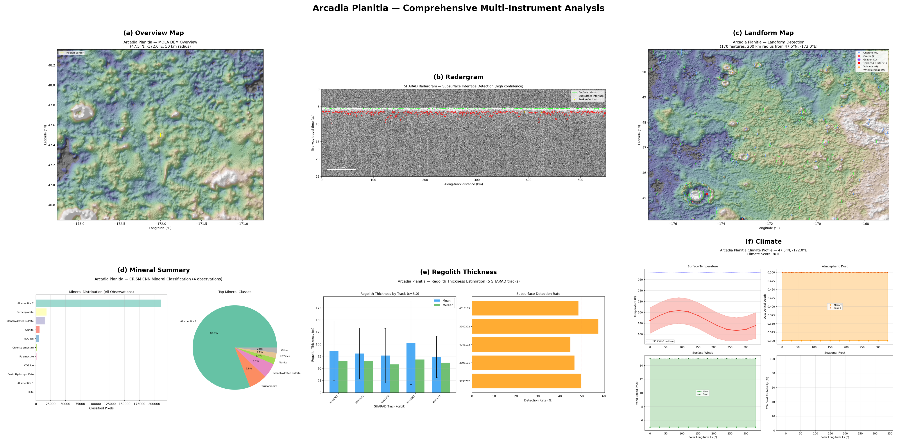

## 1. Landform Detection (MOLA DEM)

**Total features detected:** 170

| Feature Type | Count |
|---|---|
| Craters | 3 |
| Volcanics | 6 |
| Graben | 1 |
| Channels | 62 |
| Ridges | 98 |
| Ldas | 0 |

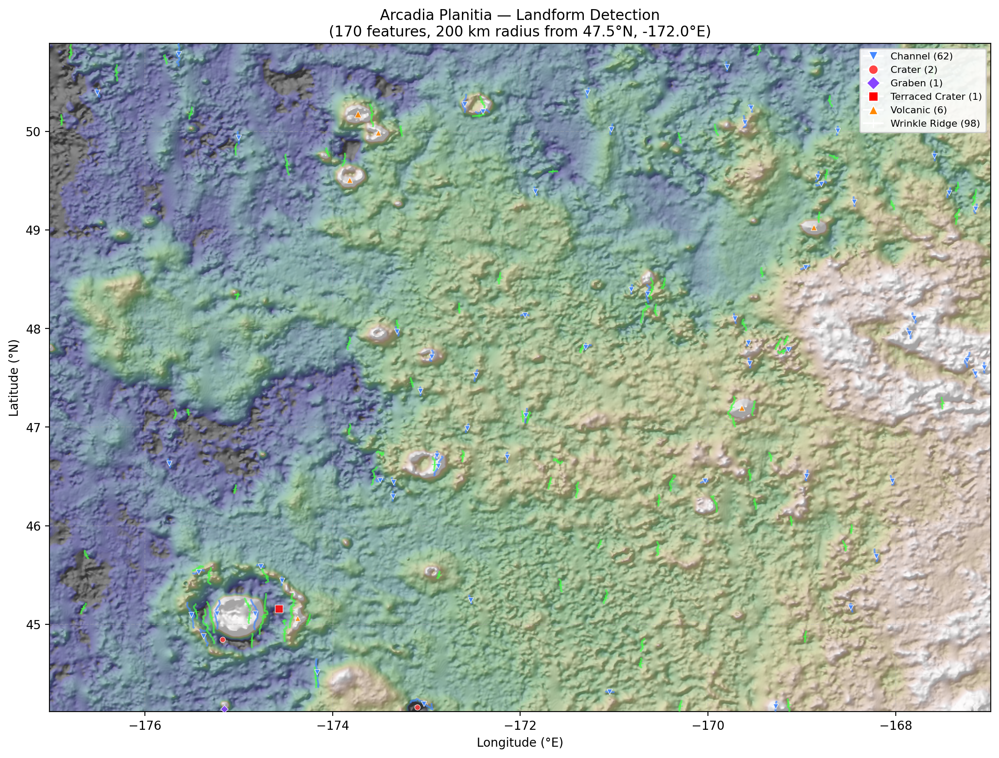

### Notable Features

| Type | Lat | Lon | Size | Depth/Height | Confidence | Description |
|---|---|---|---|---|---|---|
| terraced_crater | 45.16 | -174.57 | 15.3 km | 96 m | 0.242 | Terraced crater (1 bench, terrace depth 20 m), d/D=0.0063, c |
| volcanic | 50.18 | -173.73 | 10.9 km | 109 m | 0.244 | Volcanic construct (10.9 km), mean flank slope 2.0 deg, reli |
| volcanic | 49.03 | -168.87 | 8.2 km | 186 m | 0.591 | Volcanic construct (8.2 km), mean flank slope 3.1 deg, relie |
| volcanic | 47.20 | -169.64 | 8.1 km | 168 m | 0.592 | Volcanic construct (8.1 km), mean flank slope 3.2 deg, relie |
| volcanic | 49.50 | -173.82 | 7.8 km | 132 m | 0.201 | Volcanic construct (7.8 km), mean flank slope 2.0 deg, relie |
| volcanic | 49.99 | -173.51 | 7.5 km | 62 m | 0.320 | Volcanic construct (7.5 km), mean flank slope 1.3 deg, relie |
| crater | 44.16 | -173.10 | 7.0 km | 102 m | 0.514 | Simple crater, d/D=0.0146, circularity=0.892 |
| volcanic | 45.06 | -174.37 | 6.3 km | 77 m | 0.341 | Volcanic construct (6.3 km), mean flank slope 2.0 deg, relie |
| crater | 44.84 | -175.17 | 5.2 km | 41 m | 0.448 | Simple crater, d/D=0.0078, circularity=0.859 |
| graben | 44.14 | -175.15 | - | 136 m | 0.741 | Graben, 20.6 km x 3.3 km, aspect ratio 6.2, depth 136 m |
| channel | 44.51 | -174.17 | - | 0 m | 0.529 | Channel/valley: length 17.1 km, width ~1.1 km, depth ~0 m, s |
| channel | 44.19 | -173.03 | - | 0 m | 0.409 | Channel/valley: length 17.7 km, width ~4.1 km, depth ~0 m, s |
| channel | 45.10 | -175.51 | - | 0 m | 0.394 | Channel/valley: length 17.1 km, width ~3.1 km, depth ~0 m, s |
| channel | 44.88 | -175.37 | - | 0 m | 0.394 | Channel/valley: length 14.0 km, width ~3.1 km, depth ~0 m, s |
| channel | 50.02 | -171.03 | - | 0 m | 0.377 | Channel/valley: length 6.0 km, width ~1.0 km, depth ~0 m, si |
| channel | 50.79 | -175.64 | - | 0 m | 0.372 | Channel/valley: length 14.4 km, width ~2.8 km, depth ~0 m, s |
| channel | 49.29 | -168.44 | - | 0 m | 0.365 | Channel/valley: length 5.2 km, width ~0.9 km, depth ~0 m, si |
| channel | 47.79 | -169.15 | - | 0 m | 0.361 | Channel/valley: length 6.8 km, width ~1.5 km, depth ~0 m, si |
| channel | 47.12 | -171.94 | - | 0 m | 0.353 | Channel/valley: length 8.3 km, width ~1.5 km, depth ~0 m, si |
| channel | 49.38 | -167.43 | - | 0 m | 0.352 | Channel/valley: length 5.6 km, width ~1.1 km, depth ~0 m, si |

## 2. SHARAD Subsurface Interface Detection

**Track:** R_3933702_001_SS19_700_A
**Traces:** 30,617
**Detection rate:** 81.3%
**Confidence:** high

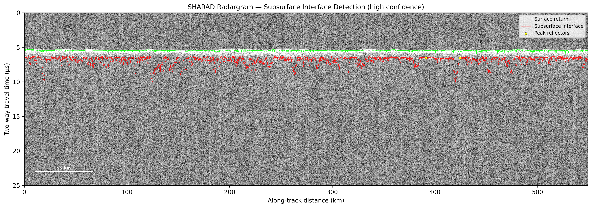

### Depth Estimates by Dielectric Model

| Material | ε_r | Mean Depth (m) | Min (m) | Max (m) |
|---|---|---|---|---|
| Vacuum | 1.00 | 212.7 | 129.3 | 685.8 |
| Porous Ice | 2.80 | 127.1 | 77.3 | 409.8 |
| Pure Water Ice | 3.10 | 120.8 | 73.4 | 389.5 |
| Basalt (low) | 4.00 | 106.3 | 64.6 | 342.9 |
| Basalt (mid) | 5.00 | 95.1 | 57.8 | 306.7 |
| Basalt (high) | 6.00 | 86.8 | 52.8 | 280.0 |

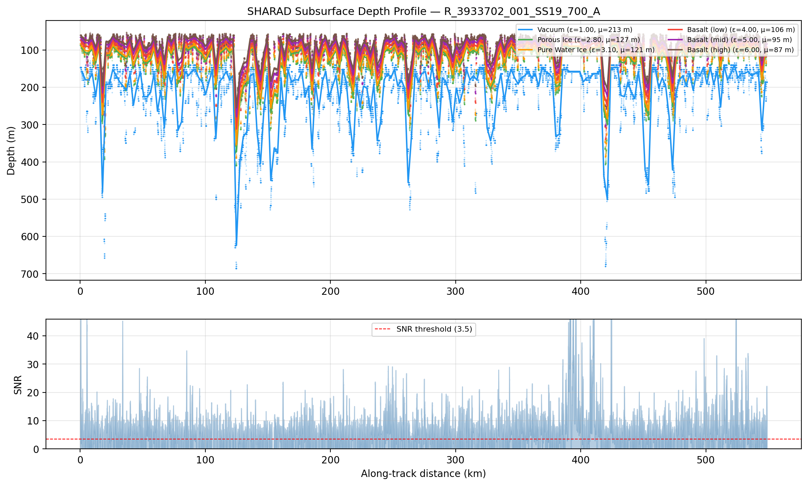

## 3. Regolith Thickness Estimation (RTE)

**Tracks analyzed:** 5
**Assumed ε_r:** 3.0
**Aggregate mean thickness:** 84.0 m
**Aggregate median thickness:** 63.6 m
**Aggregate detection rate:** 49.4%

| Track | Mean (m) | Median (m) | Std (m) | Det. Rate | SNR |
|---|---|---|---|---|---|
| R_3933702_001_SS19_7 | 86.3 | 64.9 | 61.6 | 49.6% | 18.1 |
| R_3898101_001_SS19_7 | 80.8 | 64.9 | 52.9 | 46.6% | 20.1 |
| R_4043102_001_SS19_7 | 76.5 | 58.4 | 56.4 | 44.8% | 27.9 |
| R_3940302_001_SS19_7 | 102.7 | 68.2 | 86.1 | 57.5% | 13.7 |
| R_4018103_001_SS19_7 | 73.9 | 61.7 | 42.8 | 48.4% | 24.3 |

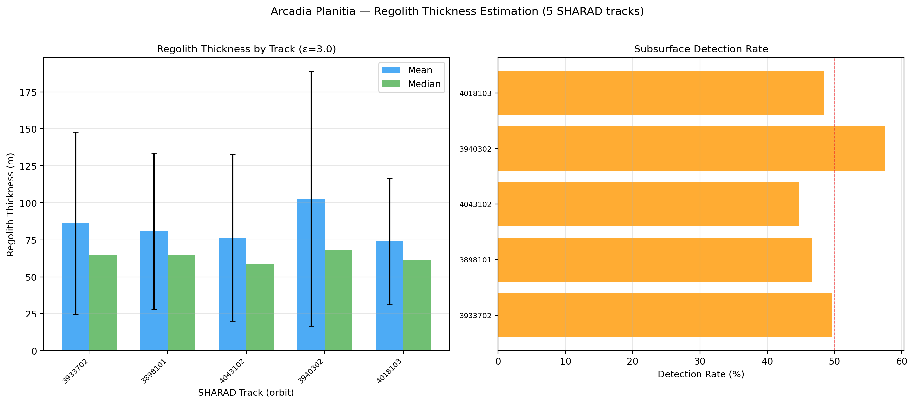

## 4. Radar Attenuation & Material Classification

**Tracks analyzed:** 3

| Track | α (dB/m) | Dominant Material | Det. Rate |
|---|---|---|---|
| R_3933702_001_SS19_7 | 0.1212 | Clay-rich / briny | 42.0% |
| R_3898101_001_SS19_7 | 0.1263 | Clay-rich / briny | 40.0% |
| R_4043102_001_SS19_7 | 0.1101 | Clay-rich / briny | 37.2% |

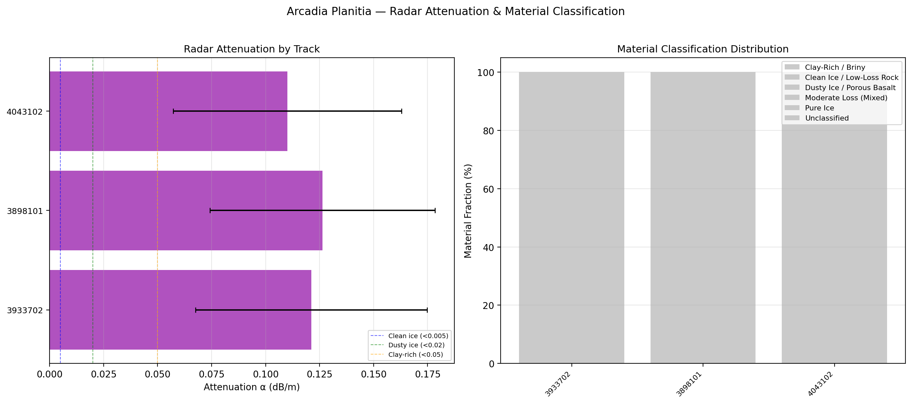

## 5. CRISM Mineral Classification (CNN)

**Observations with CNN results:** 4

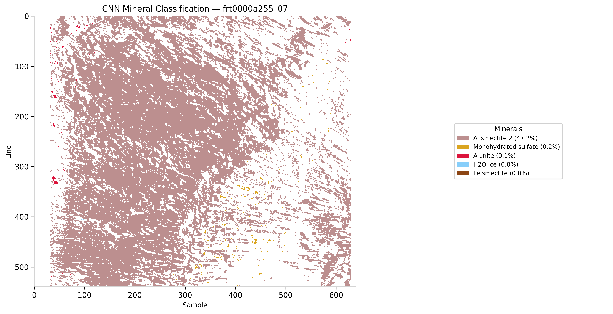

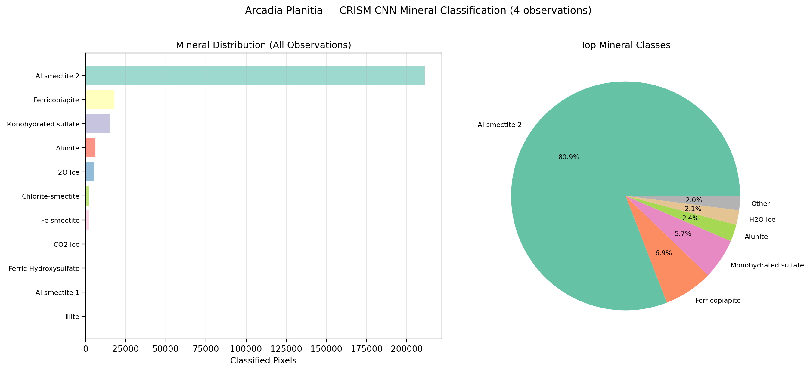

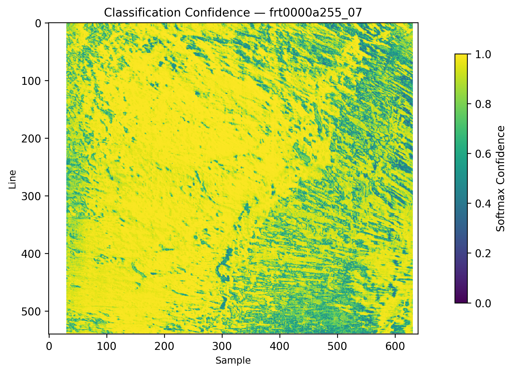

## 6. Integrated Stratigraphic Column

**Location:** 47.2°N, -166.3°E (D=20.0 km)
**Layers:** 3
**Total depth:** 12.3 m
**Instruments:** HiRISE

| Depth Top (m) | Depth Bottom (m) | Thickness (m) | Mineral | ε_r |
|---|---|---|---|---|
| 0.0 | 0.8 | 0.8 | None | - |
| 0.8 | 9.8 | 9.0 | None | - |
| 9.8 | 12.3 | 2.5 | None | - |

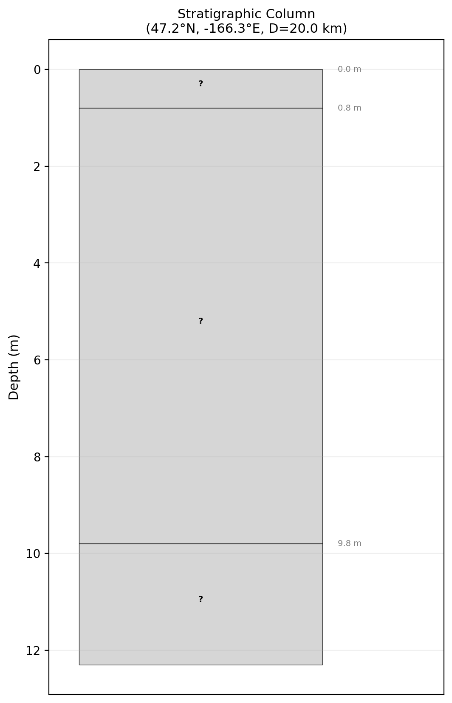

## 7. Terrain Slope Analysis

**Mean slope:** 0.34°
**Max slope:** 4.74°
**Std slope:** 0.30°
**>5° fraction:** 0.0%
**>15° fraction:** 0.0%

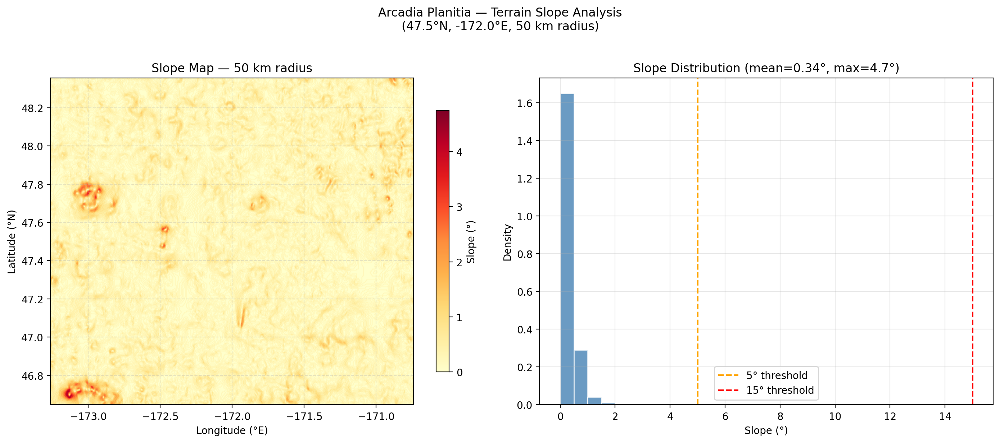

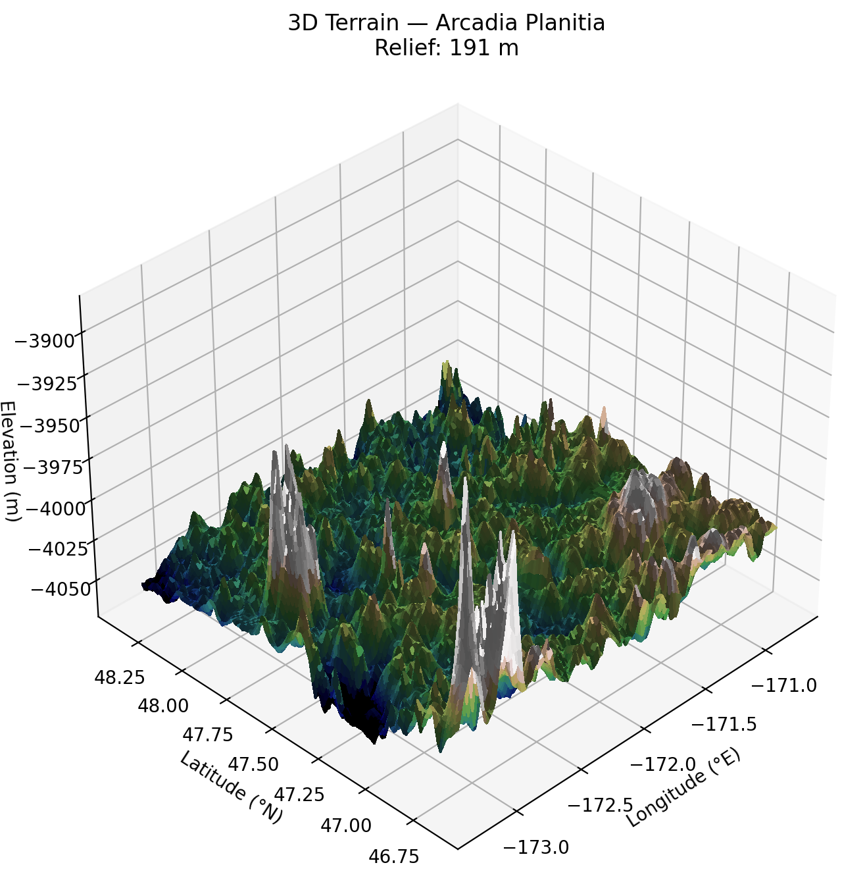

## 8. Mars Climate Model

**Climate score:** 8/10
**Mean temperature:** 203.5 K (-69.6 °C)
**Temperature range:** 179.8 — 227.2 K
**Surface pressure:** 636 Pa
**Dust opacity:** τ_mean = 0.32, storm risk = LOW
**Wind:** mean = 5.4 m/s, gust = 13.4 m/s
**CO₂ frost:** probability = 0.0%, seasonal = False

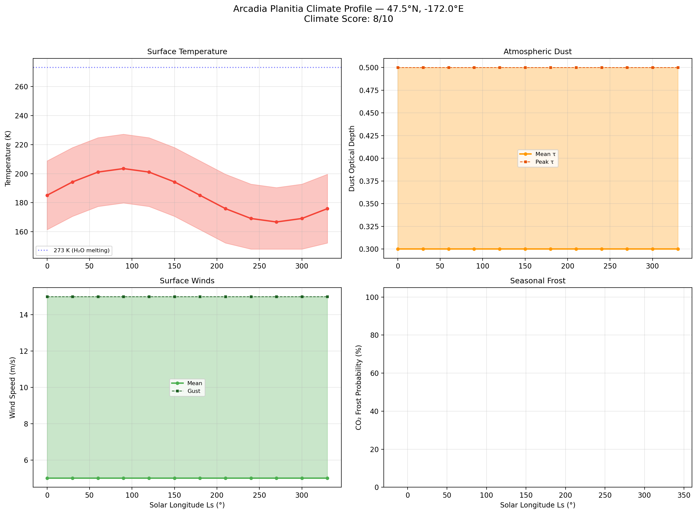

## 9. Synthesis & Conclusions

### Key Findings

- **Landforms:** 170 features detected across 200 km radius, including 3 craters, 62 channels, 98 ridges, and 0 LDAs.
- **Subsurface:** SHARAD interface detected with 81.3% rate (high confidence). Porous Ice model (ε=2.80) gives mean depth ~127 m (range 77-410 m).
- **Regolith:** Mean thickness 84.0 m across 5 tracks (ε=3.0), detection rate 49.4%.
- **Material:** Dominant subsurface material classified as **Clay-rich / briny** from radar attenuation analysis.
- **Climate:** Score 8/10. Mean temperature 204 K, CO₂ frost probability 0%.

### Figures Index

| # | Figure | Description |
|---|---|---|
| 1 | `fig_landform_map.png` | Landform Map |
| 2 | `fig_radargram.png` | Radargram |
| 3 | `fig_depth_profile.png` | Depth Profile |
| 4 | `fig_regolith_thickness.png` | Regolith Thickness |
| 5 | `fig_attenuation.png` | Attenuation |
| 6 | `fig_mineral_frt0000a255_07.png` | Mineral Map |
| 7 | `fig_confidence_map.png` | Confidence Map |
| 8 | `fig_mineral_summary.png` | Mineral Summary |
| 9 | `fig_strat_column.png` | Strat Column |
| 10 | `fig_slope_map.png` | Slope Map |
| 11 | `fig_terrain_3d.png` | Terrain 3D |
| 12 | `fig_climate.png` | Climate |
| 13 | `fig_overview_map.png` | Overview Map |
| 14 | `fig_synthesis_composite.png` | Synthesis |

---
*Report generated by MarsLab v2.0 — 2026-02-19 11:49:04 UTC*